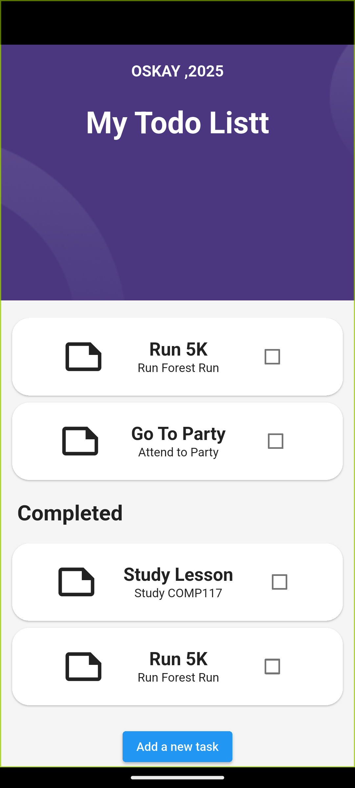

# Flutter Projects Collection

This repository brings together practical Flutter and Dart applications developed while exploring mobile UI development, REST integration, state-driven screens and Firebase services. Each folder is an independent project and can be run on its own.

## Highlights

- Flutter and Dart applications for Android, iOS, web and desktop targets
- REST API consumption, JSON parsing and asynchronous UI updates with the `http` package
- Firebase Authentication and Cloud Firestore integration
- Responsive UI composition, reusable widgets, theming and local assets
- Small focused projects that document the progression from Dart fundamentals to data-backed mobile applications

## Projects

| Folder | Focus | Key technologies |
| --- | --- | --- |
| [`todo_app`](./todo_app) | Task dashboard that loads completed and pending items from DummyJSON and supports adding a new task through an API request. | Flutter, Dart, HTTP, JSON, FutureBuilder |
| [`rest_api`](./rest_api) | Comments client that fetches and posts data through the JSONPlaceholder REST API. | Flutter, Dart, HTTP, REST API |
| [`firebase`](./firebase) | Authentication flow with registration, login, logout and user profile persistence. | Firebase Core, Firebase Auth, Cloud Firestore |
| [`theme_demo`](./theme_demo) | Theme switching examples for light, dark and system appearance modes. | Flutter ThemeData |
| [`flutter1`](./flutter1) | UI and widget experiments using custom colours, local assets and Google Fonts. | Flutter UI, Google Fonts |
| [`dart`](./dart) | Foundational Dart exercises and language notes. | Dart |

## Featured Work

### Todo App

The Todo App models API data as Dart objects and renders asynchronous states in a task-focused interface. It reads completed and unfinished tasks from DummyJSON, groups task types visually and sends new-task requests to the API. The project is a focused example of API integration, model mapping and stateful Flutter screens.

<p align="center">
  
  
</p>

### Firebase Authentication App

This project initializes Firebase at startup, routes users according to authentication state and provides registration, login and logout flows. User information is persisted through Cloud Firestore, separating authentication responsibilities from profile data access.

## Run a Project Locally

Each application has its own `pubspec.yaml`. Open the folder of the project you want to run, then execute:

```bash
flutter pub get
flutter run
```

For example:

```bash
cd todo_app
flutter pub get
flutter run
```

### Firebase Setup

The `firebase` project requires a Firebase project with Authentication and Cloud Firestore enabled. Its generated platform configuration is already included for the existing setup. If you connect a different Firebase project, regenerate the configuration with FlutterFire CLI and avoid committing private service-account credentials.

## Repository Structure

```text
flutter_project/
├── dart/          # Dart fundamentals
├── firebase/      # Firebase authentication and Firestore
├── flutter1/      # UI and widget experiments
├── rest_api/      # REST API client
├── theme_demo/    # Theme management examples
└── todo_app/      # API-backed task application
```

## Tech Stack

**Language and framework:** Dart, Flutter  
**Backend integration:** REST APIs, JSON, HTTP  
**Firebase:** Firebase Core, Firebase Authentication, Cloud Firestore  
**UI:** Material Design, ThemeData, reusable widgets, local assets and Google Fonts

## Notes

These projects are intentionally separated so that each repository folder can demonstrate one main concept clearly. They can be used as references for Flutter UI construction, API usage and Firebase-backed authentication workflows.
